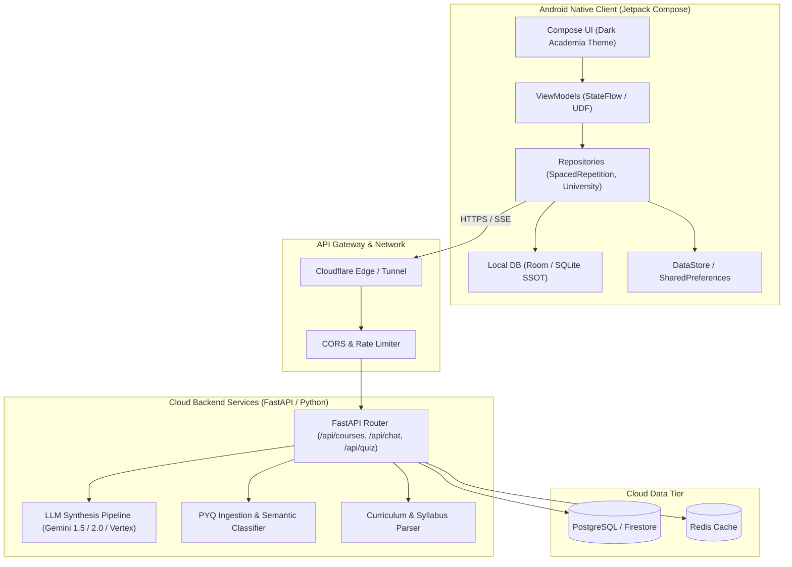
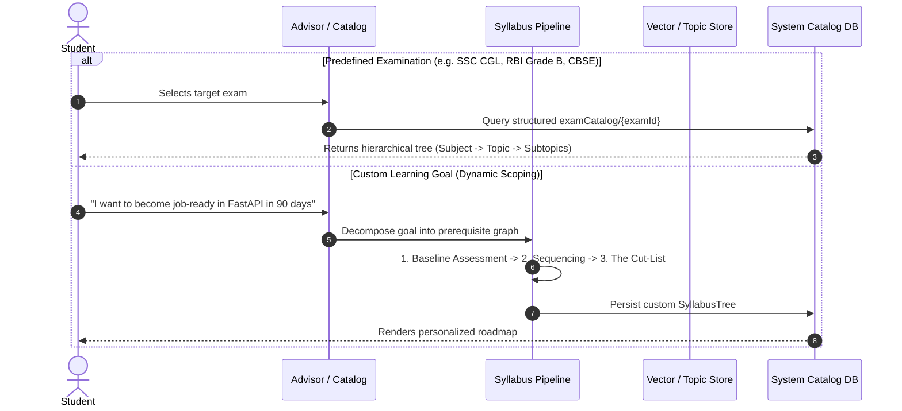
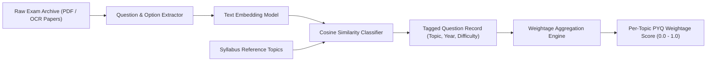
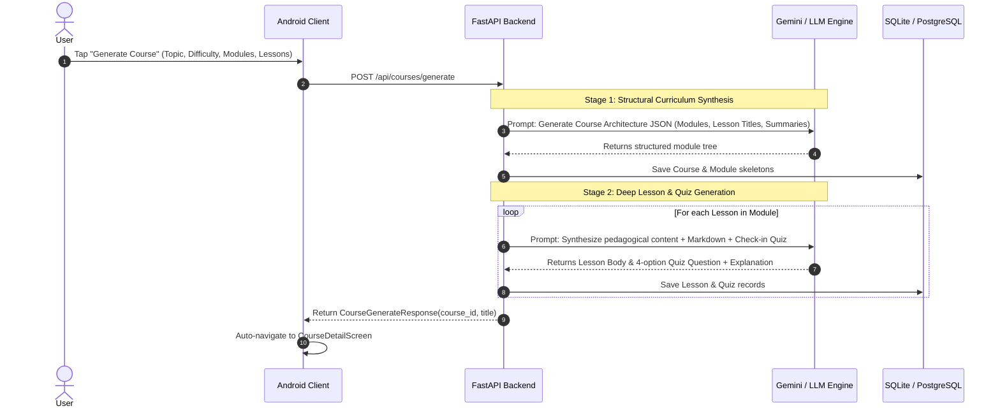
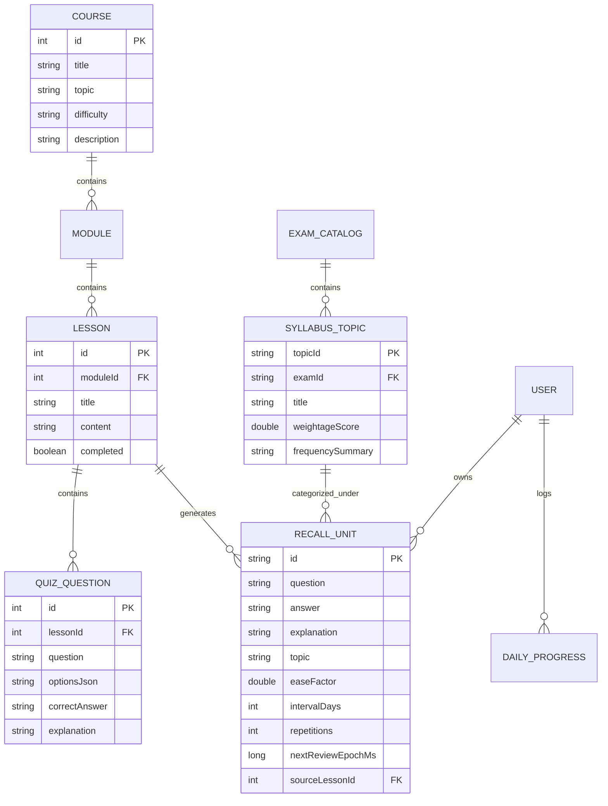

# Software Requirements Specification (SRS)
## Personal University × Kaizen Study — Intelligent Adaptive Learning & Spaced-Repetition Platform

---

### Document Control
- **Document Version**: 2.0 (Integrated Production Edition)
- **Status**: Approved Architecture Specification
- **Target Platforms**: Android (Kotlin, Jetpack Compose), Backend Microservices (FastAPI, Python 3.11+, Cloud Run/Render), Cloud Persistence (Firestore/PostgreSQL)
- **Audience**: Mobile Engineers, Backend Architects, ML/Data Engineers, Systems Operators

---

## 1. Introduction

### 1.1 Purpose
This document specifies the technical, functional, data, and architectural requirements for **Personal University × Kaizen Study**, an intelligent cognitive learning platform that unites two educational paradigms:
1. **The ALTER Pedagogical Council**: Deep conceptual comprehension driven by 5 specialized AI personas (**A**cademic Advisor, **L**ibrarian, **T**utor, **E**ditor, **R**oommate).
2. **The Kaizen Spaced-Repetition Engine**: Long-term memory consolidation powered by an algorithmic **SuperMemo-2 (SM-2)** scheduling model, automated lesson-quiz harvesting, and Previous Year Question (PYQ) weightage scoring.

### 1.2 Product Scope & Core Philosophy
Conventional learning software suffers from a structural dichotomy:
- **Flashcard Apps (e.g., Anki)** optimize for rote memory retention via spaced repetition, but provide zero assistance when a student suffers a fundamental conceptual misunderstanding.
- **AI Chatbots (e.g., ChatGPT wrappers)** provide ad-hoc explanations and text generation, but lack curriculum sequencing, exam targeting, and longitudinal memory retention mechanisms.

**Personal University × Kaizen Study** resolves this dichotomy by establishing a closed-loop learning lifecycle:
$$\text{Orientation (Advisor/Catalog)} \longrightarrow \text{Comprehension (Tutor/Roommate)} \longrightarrow \text{Testing (Quizzes)} \longrightarrow \text{Harvesting (Recall Units)} \longrightarrow \text{Consolidation (SM-2)} \longrightarrow \text{Remediation (Diagnostic Chat)}$$

### 1.3 Definitions, Acronyms & Abbreviations
- **ALTER**: Academic Advisor, Librarian, Tutor, Editor, Roommate.
- **SM-2**: SuperMemo-2 spaced-repetition algorithm adjusting card intervals based on self-reported recall performance.
- **Recall Unit**: The atomic flashcard or question/answer concept pair tracked by the scheduling engine.
- **PYQ**: Previous Year Question extracted from official competitive/academic exam archives.
- **Weightage**: Historical frequency and trend score representing the probability of a topic appearing on an exam.
- **Ease Factor (EF)**: A per-unit multiplier ($EF \ge 1.3$, default $2.5$) governing exponential interval expansion.
- **SSOT**: Single Source of Truth.
- **UDF**: Unidirectional Data Flow (State $\rightarrow$ UI, Events $\rightarrow$ ViewModel).

---

## 2. System Architecture & High-Level Design

### 2.1 Multi-Tier Topology

---

## 3. Data Ingestion & Synthesis Engine

This section details how the platform sources and structures **Syllabi**, **PYQs**, and **Interactive Courses**.

### 3.1 Syllabus Construction & Ingestion Pipeline

The platform supports two distinct syllabus pipelines: **Structured Predefined Syllabi** and **Dynamic AI-Scoped Curricula**.

#### Pipeline Mechanics:
1. **Hierarchical Taxonomy**:
   Every syllabus is modeled as a Directed Acyclic Graph (DAG) or 3-level tree:
   $$\text{Exam} \longrightarrow \text{Subjects} \longrightarrow \text{Topics} \longrightarrow \text{Subtopics (Leaf Units)}$$
2. **Official Corpus Ingestion**:
   Official exam notifications and board syllabi (PDF/HTML) are ingested through a document parser. Structural headings are converted into standardized JSON structures with explicit learning objectives.

---

### 3.2 Previous Year Question (PYQ) Ingestion & Weightage Model

To eliminate subjective guesswork, review priority is weighted by empirical examination frequency.

#### 1. Ingestion & Semantic Tagging
* Past 5–10 years of official exam papers are parsed into discrete question objects.
* Each question $q$ is mapped to a syllabus topic $t$ using text embeddings:
  $$\text{Score}(q, t) = \frac{\mathbf{E}(q) \cdot \mathbf{E}(t)}{\|\mathbf{E}(q)\| \|\mathbf{E}(t)\|}$$
* Questions scoring above the confidence threshold ($\ge 0.82$) are assigned automatically; lower scores are flagged for secondary human review.

#### 2. Mathematical Weightage Algorithm
A topic's weightage score $W_t \in [0, 1]$ is computed as a time-decayed frequency formula:
$$W_t = \frac{\sum_{i=1}^{N} \lambda^{(Y_{\text{current}} - Y_i)}}{\sum_{\text{all topics}} \sum_{i} \lambda^{(Y_{\text{current}} - Y_i)}}$$
Where:
- $Y_i$ is the year question $i$ appeared.
- $\lambda \in (0, 1]$ is the recency decay factor ($\lambda = 0.90$ typically), ensuring recent syllabus shifts outweigh older patterns.
- $W_t$ directly determines priority tags in the UI (e.g. `92% PYQ Weightage`).

#### 3. Daily Planner Integration (SRS FR-6.3)
Weightage is used as a **tie-breaker and queue sorting multiplier**, not an absolute override:
$$\text{PriorityScore}(u) = \text{Urgency}_{\text{SM2}}(u) \times (1.0 + 0.5 \times W_{t(u)})$$
Cards with overdue intervals are never suppressed, but high-weightage exam topics surface first within the daily queue.

---

### 3.3 Course & Lesson Generation Pipeline

When a user initiates course generation in the Tutor module, the system orchestrates a 2-stage generative synthesis:

#### Automated Harvesting into Spaced Repetition
When the student marks a lesson completed:
1. The client catches `LessonViewModel.markComplete()`.
2. All verified quiz questions ([`QuizQuestionDto`](file:///C:/Users/mynam/OneDrive/Documents/project/Personal%20University/app/src/main/java/com/personaluniversity/app/data/model/Models.kt#L78)) are extracted.
3. Cards are injected into the local `RecallUnit` store with initial parameters:
   - $EF = 2.5$
   - $Interval = 0$ days
   - $Repetitions = 0$
   - $NextReviewDate = \text{Immediate (Due Today)}$
4. The user transitions seamlessly from reading comprehension directly into their daily retention loop.

---

## 4. Scalability & Systems Engineering

### 4.1 Mobile Client Scalability (Android / Jetpack Compose)

1. **Offline-First Single Source of Truth (SSOT)**:
   - Core review features must function with **zero network connectivity**.
   - Review scheduling updates are written immediately to the local disk (Room / SQLite) and queued in an asynchronous sync queue.
2. **Lazy UI Rendering & Window Virtualization**:
   - Long lesson texts and 100+ module course outlines are virtualized via Compose `LazyColumn` using stable keys (`items(items, key = { it.id })`) to ensure zero re-composition stutter (locked at 60–120 FPS).
3. **Dynamic Base URL Architecture**:
   - Mobile network routing is decoupled from compile-time flags. Network requests resolve against a thread-safe, runtime-configurable host stored in encrypted `SharedPreferences`, permitting seamless live switching between local emulators, local LAN IPs, Cloudflare tunnels, and production cloud endpoints.

### 4.2 Backend & Cloud Scalability

1. **Asynchronous Generation Decoupling**:
   - Long-running LLM generation tasks (30–90s) are offloaded to an asynchronous task queue (Celery with Redis or Google Cloud Tasks).
   - HTTP clients receive immediate `202 Accepted` tokens with polling/WebSocket progress endpoints, preventing gateway timeouts (Cloudflare 100s HTTP timeout threshold).
2. **Token Streaming (Server-Sent Events)**:
   - Interactive role chats (Advisor, Tutor, Editor, Roommate) stream tokens via SSE (`text/event-stream`), lowering Time-To-First-Token (TTFT) from ~8,000ms to $< 400\text{ms}$.
3. **Stateless Horizontally Scalable Web Tier**:
   - The FastAPI application is containerized via Docker and packaged with multi-worker ASGI runtimes (`uvicorn -w 4 -k uvicorn.workers.UvicornWorker`).
   - Container instances scale from 0 to $N$ instances based on CPU utilization and request concurrency.

### 4.3 Caching Hierarchy

| Tier | Technology | Target Data | Invalidation Policy |
| :--- | :--- | :--- | :--- |
| **L1 (Client Memory)** | Compose State / In-Memory Cache | Active flashcard queue, current chat thread | On screen dispose |
| **L2 (Client Disk)** | Room / SQLite DB | Downloaded courses, historical recall units | Local update / Sync diff |
| **L3 (Backend Cache)** | Redis / In-Memory KV | Exam syllabi, PYQ weightage rankings, LLM completions | TTL (24 hours) |
| **L4 (Persistent DB)** | PostgreSQL / Cloud Firestore | User profiles, full historical archives, global analytics | Permanent (Write-through) |

---

## 5. Functional Requirements (FR)

### 5.1 Account, Environment & Network
- **FR-1.1**: The system shall support runtime configuration and persistent storage of the backend host address without requiring APK recompilation.
- **FR-1.2**: The Android client shall remain fully operational for reviewing existing recall units and reading cached courses while offline.
- **FR-1.3**: The system shall provide an automated GitHub Actions CI/CD pipeline that compiles, tests, and packages the Android application upon code push.

### 5.2 Syllabus & Exam Exploration
- **FR-2.1**: The system shall display predefined competitive examination catalogs (e.g. SSC CGL, RBI Grade B, Computer Science Systems) structured by subjects and topics.
- **FR-2.2**: The system shall display historical PYQ weightage badges (e.g. `92% PYQ`) for topics with calculated examination frequency.
- **FR-2.3**: The user shall be able to trigger instant course generation for any syllabus topic with a single tap.

### 5.3 Spaced Repetition (Kaizen Engine)
- **FR-3.1**: The system shall calculate review schedules using the SuperMemo-2 (SM-2) algorithm.
- **FR-3.2**: The review screen shall present a 4-tier self-rated recall scale: `Again` (1), `Hard` (3), `Good` (4), `Easy` (5).
- **FR-3.3**: If the user rates a card `Again`, repetitions shall reset to 0, interval shall reset to 1 day, and the ease factor shall be reduced.
- **FR-3.4**: The system shall enforce an absolute Ease Factor floor ($EF \ge 1.3$).
- **FR-3.5**: Anti-Burnout Protection: Following missed study sessions, the system shall cap the daily review queue to a configurable threshold (e.g., maximum 20 due cards + 5 new cards) to prevent demotivating backlog pileups.

### 5.4 Smart Pedagogical Remediation
- **FR-4.1**: During flashcard review, the interface shall provide a `"Stuck? Ask Roommate"` button.
- **FR-4.2**: Tapping remediation shall trigger a background inference call requesting a lateral, real-world analogy for the specific concept without forfeiting the user's active flashcard state.

### 5.5 ALTER Council Interactions
- **FR-5.1**: The system shall provide dedicated multi-turn conversation modes for each ALTER persona:
  - **Advisor**: Socratic roadmapping, milestone scoping, cut-list generation.
  - **Librarian**: Recommending canonical texts, papers, and primary documentation.
  - **Tutor**: Diagnostic questioning and conceptual testing.
  - **Editor**: Constructive critique of user essays, code, and arguments.
  - **Roommate**: Analogy synthesis and lateral concept deconstruction.

### 5.6 Progress Tracking & Analytics
- **FR-6.1**: The system shall record and display daily study consistency across a 14-day visual heatmap.
- **FR-6.2**: The system shall calculate and render the active consecutive-day streak counter.
- **FR-6.3**: The system shall compute retention accuracy percentages and the count of graduated "Mastered" concepts (repetition count $\ge 3$).

---

## 6. Non-Functional Requirements (NFR)

### 6.1 Performance Requirements
- **NFR-1.1**: The today's review queue shall load and render from local disk in $< 300\text{ms}$.
- **NFR-1.2**: Cold start time of the Android client shall not exceed $1.5\text{s}$ on mid-tier hardware (Snapdragon 7-series or equivalent).
- **NFR-1.3**: Flashcard flip animations and scrolling list views shall maintain 60 FPS without frame drops.

### 6.2 Reliability & Fault Tolerance
- **NFR-2.1**: In the event of an unhandled backend network disconnection, the client shall display non-blocking error banners and preserve un-sent chat inputs in draft memory.
- **NFR-2.2**: Long-running course generation failures shall not corrupt previously stored modules or lessons in the database.

### 6.3 Security & Network Integrity
- **NFR-3.1**: Production communications shall mandate HTTPS / TLS 1.3 encryption.
- **NFR-3.2**: User credentials and API secrets shall not be committed into version control, enforced via repository `.gitignore` specifications and environment variable injection.

### 6.4 Usability & Aesthetics
- **NFR-4.1**: The application shall adhere to the defined "Dark Academia" aesthetic tokens:
  - Background: `Ink` (`#12161B`)
  - Accent / Primary: `Gold` (`#C9A050`)
  - Text Primary: `Parchment` (`#E9E4D8`)
  - Typography: Platform Serif for display headlines, Monospace for metadata badges.

---

## 7. Data Models & Entity Schemas

### 7.1 Entity Relationship Diagram

---

## 8. Verification & Test Strategy

### 8.1 Automated Unit Testing
- **Algorithm Verification**: The pure mathematical logic in [`Sm2SchedulerTest.kt`](file:///C:/Users/mynam/OneDrive/Documents/project/Personal%20University/app/src/test/java/com/personaluniversity/app/data/spacedrepetition/Sm2SchedulerTest.kt) validates:
  - Base interval expansion ($1\text{d} \rightarrow 6\text{d} \rightarrow 15\text{d}$).
  - Failure penalty resets ($Repetitions = 0, Interval = 1\text{d}$).
  - Ease factor bounds enforcement ($EF \ge 1.30$).
  - Daily queue anti-burnout capping.

### 8.2 Continuous Integration (GitHub Actions)
- Continuous build verification executed via [`.github/workflows/android-ci.yml`](file:///C:/Users/mynam/OneDrive/Documents/project/Personal%20University/.github/workflows/android-ci.yml):
  1. `testDebugUnitTest` — Compiles and runs all Kotlin unit tests.
  2. `lintDebug` — Scans for Android architectural flaws and deprecations.
  3. `assembleDebug` — Verifies end-to-end DEX compilation and produces production-valid debug APK artifacts.
